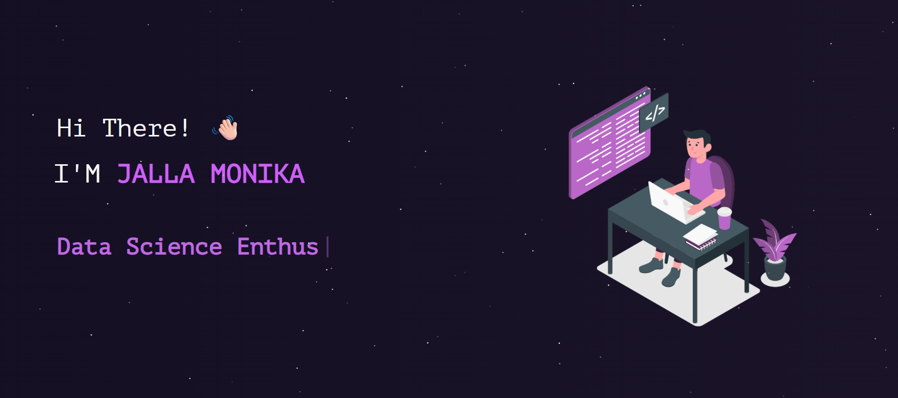

<h2 align="center">

  Jalla Monika - Portfolio Website

</h2>

<div align="center">

  

</div>

<br/>

<div align="center">

  <strong>Computer Science Undergraduate | Full Stack Developer | Data Scientist & Machine Learning Enthusiast</strong>

</div>

<br/>

## 👩‍💻 About Me

Hi! I'm **Jalla Monika**, a Computer Science undergraduate at **SRM University-AP**.

I am passionate about **Full Stack Development, Artificial Intelligence, Machine Learning, and Data Science**.

I enjoy building practical software solutions, AI-powered applications, and user-focused web platforms.

## 🛠️ Skills

### Programming Languages

- Java
- Python
- C++
- JavaScript

### Web Development

- React.js
- Node.js
- Express.js
- HTML
- CSS

### Databases

- MySQL
- MongoDB

### AI & Data

- Machine Learning
- Data Science
- NLP
- Pandas
- NumPy
- Matplotlib

### Tools

- Git
- GitHub
- VS Code

## 💼 Experience

### Full Stack Developer Intern — Exafluence

**Jun 2025 – Jul 2025 | Tirupati, Andhra Pradesh**

- Built an automated resume screening platform using Python, Flask, MySQL, and NLP.
- Reduced manual resume screening effort by approximately 60%.
- Implemented Google OAuth and automated resume parsing for PDF, DOCX, and email content.
- Developed a real-time dashboard for candidate tracking and automated communication.

## 🚀 Projects

### Sentiment Pulse AI

A Chrome extension built using **Node.js, Express.js, and Gemini AI** for multilingual sentiment analysis and website safety auditing.

Features include:

- Real-time sentiment classification
- Thematic clustering
- Smart replies
- AI-powered insights
- Trust scoring
- Dark pattern detection
- SSL verification
- Malicious link analysis

### MedAssist AI

An AI-powered clinical decision support system built using **Python, PyTorch, and EasyOCR**.

Features include:

- ResNet-18 based pneumonia detection
- 95% pneumonia detection accuracy
- Chest X-ray analysis
- OCR for prescriptions
- RxNorm integration
- Drug safety analysis
- Clinical recommendations

### Student Notes Exchange Portal

A **MERN-based** platform designed for students to share and manage academic notes.

Features include:

- Secure authentication
- File uploads
- Bookmarking
- Voting
- Commenting
- Smart search and filtering
- Admin moderation dashboard
- Responsive user interface

### Global Suicide Rate Analysis

A data analysis project focused on analyzing global suicide-rate data and identifying meaningful patterns and insights.

### Employee Management System

A software project focused on managing employee-related information and operations.

## 🎓 Education

### Bachelor of Computer Science

**SRM University-AP**

Minor: Marketing

Expected Graduation: **2027**

CGPA: **8.94**

### Class 12 — AP State Board

**2021 – 2023**

Percentage: **93.9%**

## 🏆 Achievements

- Reliance Undergraduate Scholarship — selected from 5000+ participants.
- Google Girl Hackathon — Top 10 among 1000+ participants and advanced to Round 2.
- Oracle Java SE 17 Professional Certification.
- Python Certification — Orcade Hub.
- Front-End Development — Edunet / IBM SkillsBuild.
- Python & AI Bootcamp — AFE.
- 10-Month DSA Bootcamp — AFE / Zuvy.
- MongoDB Certification — SmartBridge.

## 📜 Certifications

- Oracle Java SE 17 Professional
- Python Certification — Orcade Hub
- Front-End Development — Edunet / IBM SkillsBuild
- Python & AI Bootcamp — AFE
- DSA Bootcamp — AFE / Zuvy
- MongoDB — SmartBridge

## 🌐 Connect With Me

- **GitHub:** [monika-176-com](https://github.com/monika-176-com)
- **LinkedIn:** [Jalla Monika](https://www.linkedin.com/in/monika-jalla-199848293)

## 💻 Built With

This portfolio was built using:

- React.js
- React Bootstrap
- JavaScript
- CSS3
- Node.js
- VS Code

## ✨ Features

- 📖 Multi-page portfolio layout
- 🎨 React Bootstrap based UI
- 📱 Responsive design
- 💼 Experience section
- 🚀 Project showcase
- 🛠️ Technical skills and tools
- 📄 Resume section
- 🔗 GitHub and LinkedIn integration
- ✨ Animated particle background

## 🚀 Getting Started

### Prerequisites

You need to have **Node.js** and **Git** installed on your system.

### Installation

Clone the repository:

```bash
git clone <your-repository-url>